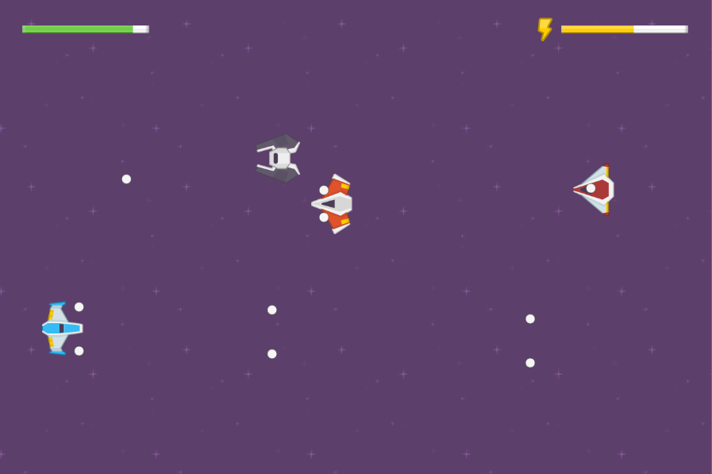

## Laptop Ship Shooter - Ludum Dare 39

Theme was "Running out of power".

Laptop Ship Shooter is a game where you have to plug in your laptop to recharge your ship's batteries. Then you unplug your laptop and shoot the enemies.

The gimmick for this one was physically plugging in your laptop to charge a device in the game.
[Unity battery status](https://docs.unity3d.com/ScriptReference/SystemInfo-batteryStatus.html)

Music by GreyScreen (Kevin Stebner)

_Ryan Dallaire July 11 2017_
