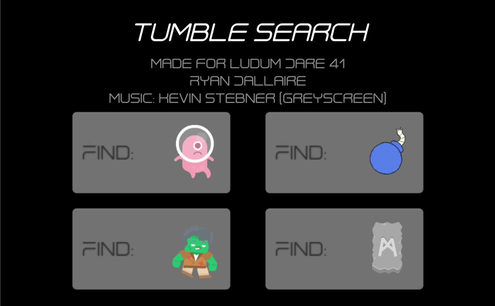
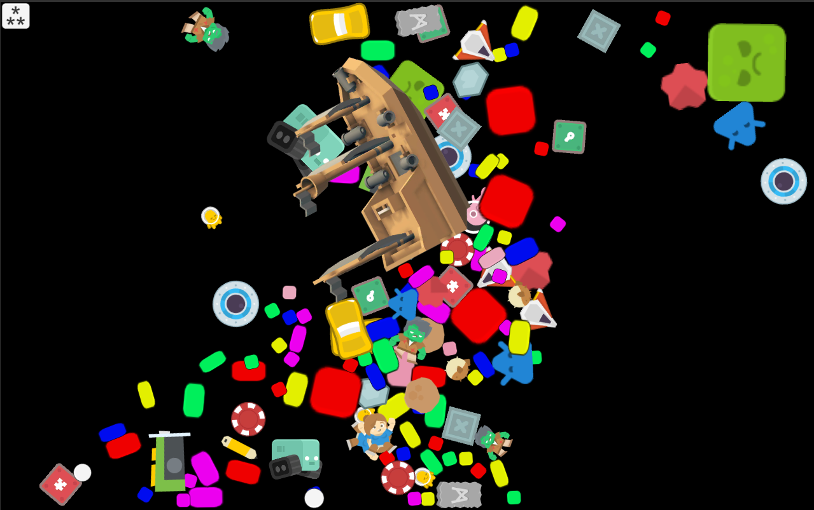

## TumbleSearch - Ludum Dare 41
The theme for Ludum Dare 41 was "Combine 2 Incompatible Genres".
The 2 genres I combined were Object find and Physics-based.
My idea was a where's waldo type game where you can tilt the world and have everything tumble around.
I was sick that weekend but I ended up with it working well on phones. So I published it on the google play store.
[Play Store](https://play.google.com/store/apps/details?id=com.freedomdown.tumblesearch)

