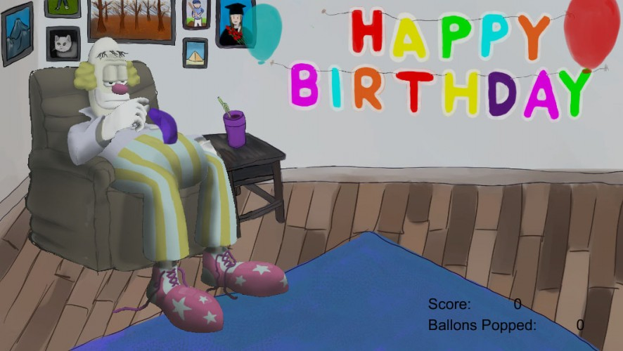

## Older Game Jam Games
### Arcafire - Made at CalCade Jam 2016

Arcafire is a competitive local multiplayer Pong dueling game. Its Pong with a modern intense fast-paced dueling twist. Arcafire was developed and designed for CalCade Jam, Calgary Game Developer Association first sponsored arcade cabinet Jam.

### Gishiki Shooter - Made at Global Game Jam 2016

Shoot and doge the enemies to get points. Double damage if you match your bullet color to the enemy color. Keep the multiplier going!

<iframe width="560" height="315" src="https://www.youtube.com/embed/CB1xTHyUWV4" frameborder="0" allow="autoplay; encrypted-media" allowfullscreen></iframe>

### Saddu, Clown for Hire - Made at Ludum Dare 34

Help this poor clown inject some fun into his soul by blowing some balloons...oh wait, he's still sad :(

[itch.io](https://madcapacity.itch.io/sadu-clown-for-hire)

### Get Out of My Way! - Made at Ludum Dare 33

It's Black Friday, and you need to buy Xmas presents! Charge through the shopping center destroying everyone/everything in your way!

<iframe width="560" height="315" src="https://www.youtube.com/embed/EH_tJ8xBhC0" frameborder="0" allow="autoplay; encrypted-media" allowfullscreen></iframe>

### Bodybag Drag - Made at Global Game Jam 2015

Drag the body from room to room to avoid letting the visitors in your home from spotting it. They will think about the room they want to go to before going there.

It is available on the [Play Store](https://play.google.com/store/apps/details?id=ca.freedomdown.BodyBagDrag)

<iframe width="560" height="315" src="https://www.youtube.com/embed/AfTiviAAbfw" frameborder="0" allow="autoplay; encrypted-media" allowfullscreen></iframe>

### 80s Tycoon - Made at Global Game Jam 2014

Run a large business in the 80s and make decisions on what to sell and what to do about the protesters on the street.

<iframe width="560" height="315" src="https://www.youtube.com/embed/OM2Y5WQO_TA" frameborder="0" allow="autoplay; encrypted-media" allowfullscreen></iframe>

### Heart Attack - Made at Global Game Jam 2013

Travelling through some one's veins destroying everything in there. But the white blood cells will try to defend the body.

<iframe width="560" height="315" src="https://www.youtube.com/embed/L8cy3gdMaBQ" frameborder="0" allow="autoplay; encrypted-media" allowfullscreen></iframe>

_Ryan Dallaire Feb 04 2017_
