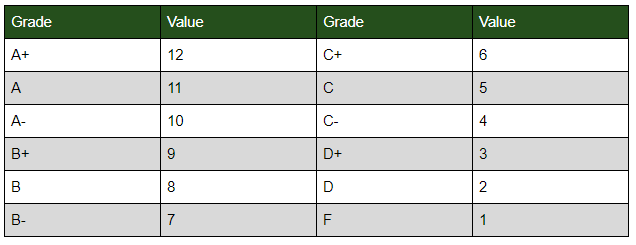

## S.A.C. RPG Prototype

**Stay After Class** is a RPG prototype set in a school, featuring students as the player characters. It came about after I had the idea of making a roleplaying game that uses a school report card as a character sheet. The report card doesn't represent the exact marks the characters got in those classes. So a student who never shows up to class and is failing all his classes wouldn't just have Fs on his character sheet.
The marks in each class are abstractions for different character traits. Each student gets several main classes that can be used to do most things. You also get to choose a couple of option classes that can be used if the situation calls for it.

### Premise
Each player controls a student at a school. They solve mysteries and fight monsters.

### Rules
Grades in classes are the stats:

**Main classes**

Phys Ed, Chemistry, Drama, History, Biology

**Extra classes**

Cooking, Shop class, Band, Math, a language, etc...

**Doing something**

Players get to pick one of their character's classes and can try to use it for a roll. They then roll a die and try to get below the value for the grade they have in that class(See grade table below). Rolling exactly the value for your grade counts as 2 successes. If you need more successes to acomplish a task, you will have to get other players to help with it.
Situational bonuses/penalties can give you +/- 2 on your roll. Such as environmental conditions and faulty/awesome equipment.

**When to roll**

The players should only roll if: they are pressed for time, can't infinitely retry the task, there is a consequence for failure.

**Grade Table**

The grades determine how good you are at the stat by setting what number you have to roll under.

**Difficulty**

Difficulty is increased by requiring multiple successful rolls from multiple characters, potentially for different classes. Trivial tasks only require 1 success. normal tasks require 2 successes. Hard tasks require 3 successes. Very hard tasks require 4 successes.

**Creating a Student**

* Pick a name and describe your character in a few lines.
* Choose an extra class to go with the 5 main classes.
* Assign grades to the classes. A, B, B-, C+, C, D

Each student has 5hp.
A failed check grants 1xp. Level up after 5 or 10xp? Solving mysteries and slaying monsters also grants xp.

### Story
Players are introduced by having them all be at school on a saturday to help clean the old band room. They were either forced to come for detention or volunteered to help out. The room used to be the music room until the music teacher suddenly disappeared. The room was turned into a storage room, and a new music room was built elsewhere when the school was renovated.
Players discover there are goblins coming up from the old steam tunnels. The goblins are weak to a particular musical note. That note gets used by the PA system in the school. The old music teacher made the jingle for the PA system.

**Goblin**

HP: 2
Successes to hit: 2
Successes to defend against: 1
Extra: Needed successes -1 when around the noise they hate.

**Goblin King**

HP: 5
Successes to hit: 3
Successes to defend against: 2
Extra: he moves to the beat of a song. If players find out, they can succeed with 1 less success.

**Other Story Ideas**

A student found an ancient text in the library and created a love potion. Now they have an army of obedient servants to do their bidding, but they also are bored with the constant admiration.

Science teacher is having their students grow plants for an assignment. None of the plants are growing properly, so she decides to secretly help the students by feeding the plants something at night. Weird chemical?

Students keep disappearing into a virtual reality matrix.

Local train station has a portal to another world.

_Ryan Dallaire Jan 17 2018_
