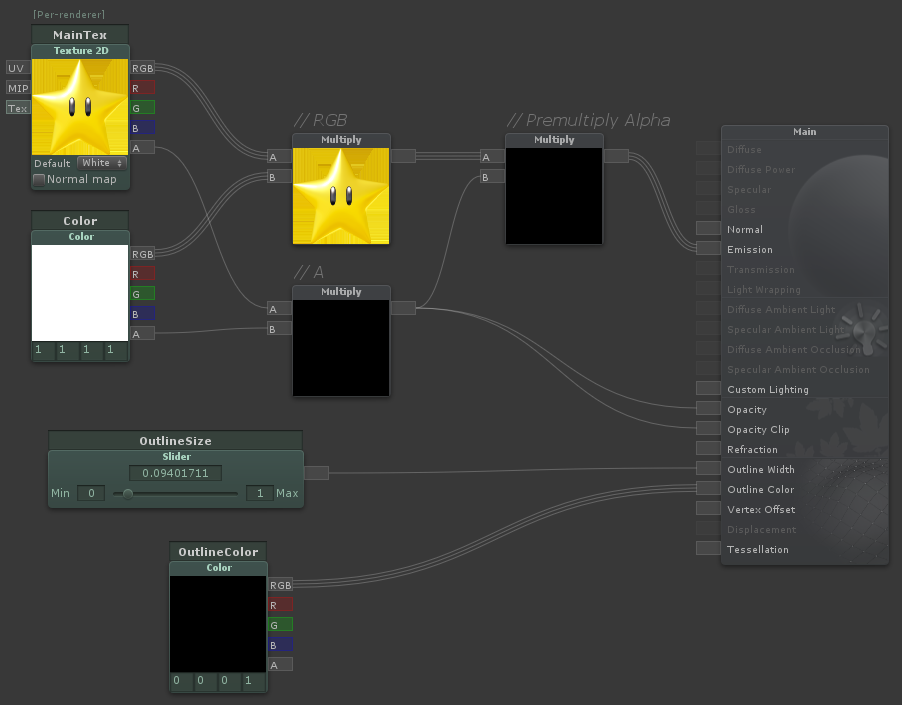
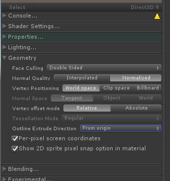

## Shader Forge 1 - 2D Sprite Outline

Intro:

I am in the process of learning Shader Forge and could not find any tutorials for building the shader effects I wanted to make. So after looking at some shader coding tutorials, I was able to get them to work. I am going to make a quick tutorial for each of them to see if that will help others learn.

Tutorial:

In this tutorial we will be making a 2D sprite shader that creates an colored outline around the sprite.

Here is the final shader:


First step is to open Shader Forge and create a new 2D sprite shader.

We will need two new properties for our shader:
* Outline Width (which I made as a slider that goes between 0 and 1.0)
* Outline Color (which is just a Color property)

Next up is to connect those properties to the slots on the shader forge output node.

I also removed the Vertex Color node that was created by default and connected the alpha channel information (labeled "// A") to the Opacity Clip slot on the output node. This makes sure that transparent pixels are not considered part of the sprite. After those changes your shader graph should look like this:



Next step is to change the outline extrude mode in Shader Forge. This can make the outline look a lot nicer. It can be found under Geometry and Outline Extrude Direction. You will want to change it to From Origin as the others don't work as well for 2D shapes.



Here is a comparison of the 3 modes: Vertex Normals, Vertex Colors, From Origin


Set the outline width to something above 0, change the MainTex to be a sprite texture, and change the preview model to be a plane or quad. This way we can test the shader using the preview to the left. What you will notice first is that the outline is only showing up when looking at the sprite from behind when vieing the preview. Also the outline color sometimes clips through the sprite, we will fix these now in code.


Make sure shader forge has compiled the your shader with all your changes.

I have not be able to figure out how to do the next steps inside shader forge, so we will be edit the shader code manually to make a couple of small changes.

First is optional and it is near the top. You will see the code below:

```
Pass {
   Name "Outline"
   Tags {
   }
   Cull Front
```
If you are using the sprites in a 3d game and need the outline to show up on the other side of the sprite change the `Cull Front` to `Cull Back`.

Next change is further down, you will see the Forward pass:
```
Pass {
   Name "FORWARD"
   Tags {
      "LightMode"="ForwardBase"
   }
   Blend One OneMinusSrcAlpha
   Cull Off
   ZWrite Off
```
Add this line below ZWrite Off:
`Offset -0.1, -0.1`

This will prevent the outline from clipping through the sprite by offsetting the sprite to be slightly in front of the outline.

Your Shader should now create a good outline like the image at the top of the page.


_Ryan Dallaire Feb 26 2018_
